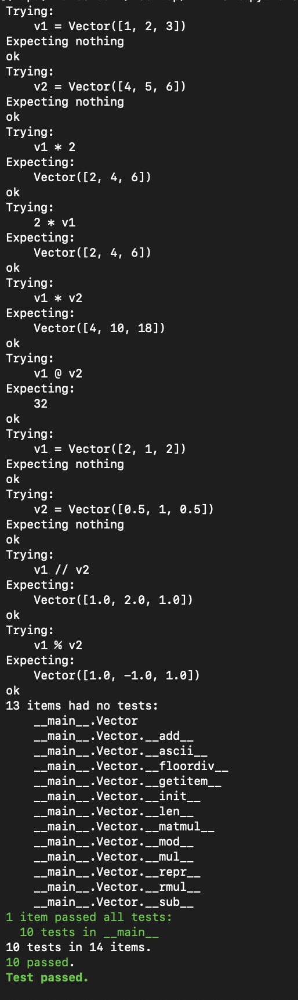
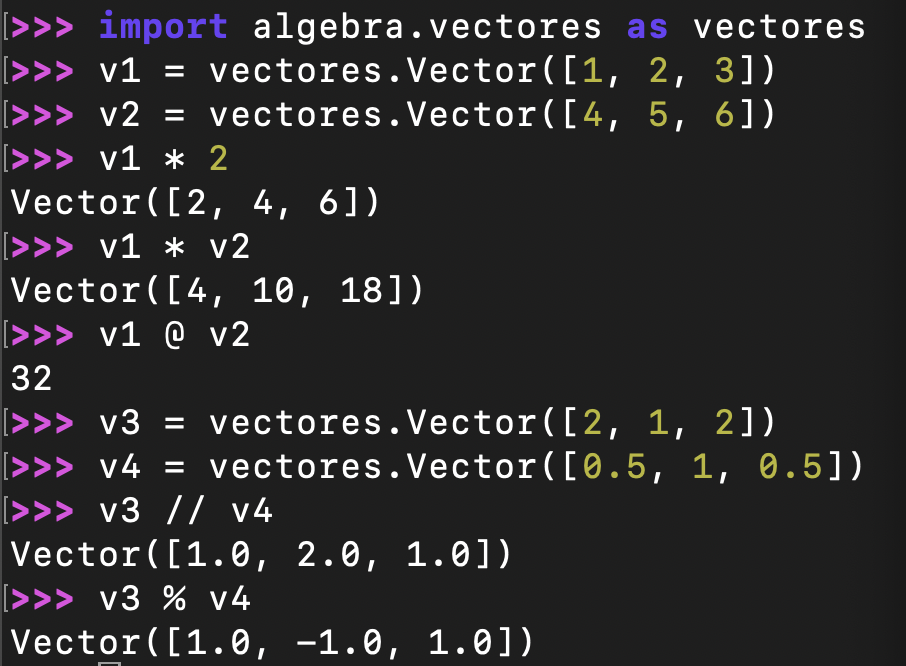

# Tercera tarea de APA: multiplicación de vectores y ortogonalidad

## Autor: Marc Grau Casado

## Clase Vector e implementación de la multiplicación de vectores

En esta práctica se ha trabajado sobre el fichero `algebra/vectores.py`, ampliando la clase `Vector` proporcionada en clase con los métodos necesarios para implementar la multiplicación de vectores y la descomposición de un vector en sus componentes paralela y perpendicular respecto a otro.

Los métodos desarrollados han sido los siguientes:

- `__mul__()` para la multiplicación de un vector por un escalar y para el producto de Hadamard entre vectores.
- `__rmul__()` para permitir también la multiplicación de un escalar por un vector.
- `__matmul__()` para implementar el producto escalar.
- `__floordiv__()` para obtener la componente paralela de un vector respecto a otro.
- `__mod__()` para obtener la componente perpendicular de un vector respecto a otro.

## Entrega

### Ejecución de los tests unitarios



Además de la ejecución de los tests unitarios, a continuación se muestran algunos ejemplos de uso del módulo, comprobando la multiplicación por escalar, el producto de Hadamard, el producto escalar y la obtención de las componentes paralela y perpendicular de un vector respecto a otro.


### Código desarrollado

Código de los métodos desarrollados en esta tarea, usando los comandos necesarios para que se realice el realce sintáctico en Python del mismo.

```python
def __mul__(self, otro):
    """
    Multiplica un vector por un escalar o realiza el producto de Hadamard.

    Args:
        otro: Escalar o vector.

    Returns:
        Vector: Resultado de la multiplicación.
    """
    if isinstance(otro, (int, float)):
        return Vector([elemento * otro for elemento in self.vector])

    if isinstance(otro, Vector):
        return Vector([a * b for a, b in zip(self.vector, otro.vector)])

    return NotImplemented


def __rmul__(self, otro):
    """
    Multiplica un escalar por un vector.

    Args:
        otro: Escalar.

    Returns:
        Vector: Resultado de la multiplicación.
    """
    return self.__mul__(otro)


def __matmul__(self, otro):
    """
    Calcula el producto escalar de dos vectores.

    Args:
        otro (Vector): Segundo vector.

    Returns:
        int | float: Producto escalar.
    """
    return sum(a * b for a, b in zip(self.vector, otro.vector))


def __floordiv__(self, otro):
    """
    Devuelve la componente paralela de un vector respecto a otro.

    Args:
        otro (Vector): Vector de referencia.

    Returns:
        Vector: Componente paralela.
    """
    coeficiente = (self @ otro) / (otro @ otro)
    return coeficiente * otro


def __mod__(self, otro):
    """
    Devuelve la componente perpendicular de un vector respecto a otro.

    Args:
        otro (Vector): Vector de referencia.

    Returns:
        Vector: Componente perpendicular.
    """
    return self - (self // otro)
```
De este modo, la clase `Vector` queda ampliada con las operaciones pedidas en el enunciado, mostrando un funcionamiento correcto tanto en los tests unitarios como en los ejemplos prácticos incluidos en esta entrega.

